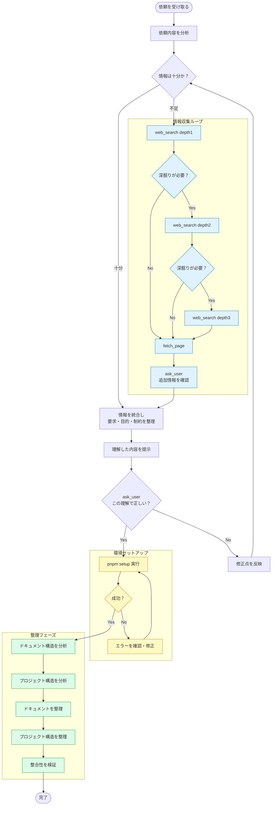

# Deep Dive Setup — 要求深掘り → セットアップ → 整理スキル

> ユーザーから求められた内容を深掘りするために `web_search(depth:1,2,3)`, `fetch_page`, `ask_user` などをして理解が正しいか最後に `ask_user` で確認し、正しければ `pnpm setup` を実行してドキュメント整理やプロジェクト構造の整理をするスキル。

## フローチャート（Mermaid）



---

## Phase 1: 依頼分析

### 1.1 依頼内容を分析

- ユーザーの発言を分解: **何を**（What） / **なぜ**（Why） / **制約**（Constraints） / **非機能**（NFR）
- `AGENTS.md` §6 と `.agent/skills/project-overview/SKILL.md` を読み、プロジェクト固有の制約を確認
- `docs/` の現状（`arch/`, `planning/`, `research/`, `task-list.md`）を確認

```bash
git status
git branch --show-current
ls docs/
cat docs/task-list.md | head -30
```

### 1.2 情報十分性チェック

| 観点 | 十分の基準 | 不足時のアクション |
|---|---|---|
| 目的 | なぜ必要かが1文で言える | Researchループへ |
| スコープ | 変更してよい/いけないファイルが明確 | Researchループへ |
| 技術選定 | 使うライブラリ・バージョンが決まっている | web_search depth1へ |
| 制約 | Termux / Sandbox / CI / 既存資産の制約が把握済み | ask_userへ |
| 完了条件 | 第三者がYes/No判定できるDoDがある | ask_userへ |

- **十分** → Phase 2へ
- **不足** → Researchループへ

---

## Phase 2: 情報収集ループ（Research）

> cod-web arena/01a0b161-cod-web 由来の `docs-maintenance` + `research/` 運用を汎用化。活発リポジトリでは調査が必須。

### 2.1 web_search depth1（事実確認）

- ライブラリの最新バージョン・公式URL・API変更の有無を確認
- `depth=1` は事実確認・URL確認レベル

```ts
// 例: 最新バージョン確認
web_search({ query: "Vite latest version npm", depth: "1" })
web_search({ query: "Next.js 16 webpack turbopack official docs", depth: "1" })
```

- **深掘りが必要？** → Yesなら depth2へ、Noなら fetch_pageへ

### 2.2 web_search depth2（標準・複数ソース比較）

- 複数ソースを比較、ベストプラクティス・ハマりどころを収集
- `depth=2` は標準

```ts
web_search({ query: "TEMPLATE_REPO bootstrap CLI best practice", depth: "2" })
web_search({ query: "Termux Next.js webpack fallback 2026", depth: "2" })
```

- **深掘りが必要？** → Yesなら depth3へ、Noなら fetch_pageへ

### 2.3 web_search depth3（深掘り・詳細仕様）

- 詳細仕様・長い記事から抜粋、セキュリティ・法規制等の影響が大きいもの
- `depth=3` は深掘り

```ts
web_search({ query: "Biome 2.x no-restricted-imports official docs", depth: "3" })
```

### 2.4 fetch_page（公式ソース確認）

- 検索で見つけた公式URLを `fetch_page` で取得、200確認・anchorまで取得可能か確認
- ミラー排除（例: `aidoczh/w3cub` は非公式、参考程度）

```ts
fetch_page({ url: "https://biomejs.dev/linter/rules/no-restricted-imports/" })
fetch_page({ url: "https://pnpm.io/installation" })
fetch_page({ url: "https://code.claude.com/docs/en/claude-directory.md" })
```

### 2.5 ask_user（追加情報確認）

- プロジェクト固有の判断が必要な場合は `ask_user` で確認
- 選択肢は2〜4個 + 自由記述、認知負荷を下げる

```ts
ask_user({
  questions: [{
    id: "project-type",
    question: "プロジェクトタイプは？",
    options: [
      { id: "vite", label: "Vite SPA", description: "Vite + React/Vue、高速HMR" },
      { id: "next", label: "Next.js", description: "SSR/SSG、App Router" },
      { id: "monorepo", label: "Monorepo", description: "Turborepo + pnpm-workspace" },
      { id: "plain", label: "Plain TS", description: "ライブラリ/最小構成" }
    ]
  }]
})
```

- 取得した情報は次の Phase 3 へ統合

---

## Phase 3: 情報統合・理解提示・確認

### 3.1 情報を統合し要求・目的・制約を整理

- Researchループで得た情報を統合:
  - **要求**（What）: ユーザーが本当に求めているもの
  - **目的**（Why）: なぜ必要か、どんな課題を解決するか
  - **制約**（Constraints）: Termux / Sandbox / CI / 既存資産 / ライセンス
  - **スコープ**（Scope）: 変更してよい/いけないファイル・機能
  - **完了条件**（DoD）: 第三者がYes/No判定できる条件
  - **リスク**（Risks）: 技術的リスク・Gotchas

```markdown
## 理解した内容

### 要求
- ...

### 目的
- ...

### 制約
- Node 24 LTS + pnpm 12.6.0 + TS 6系
- Termux 9種判定、通常環境に影響なし
- coverage 100% (src/ + scripts/lib/ 10 files)

### スコープ
- 変更対象: ...
- 境界外: ...

### 完了条件
- [ ] pnpm check 12 PASS
- [ ] docs/が新プロジェクト用に書き換え済み
- [ ] ...

### リスク
- ...
```

### 3.2 理解した内容を提示

- 上記をユーザーに提示（表形式で）

### 3.3 ask_user — この理解で正しい？

- **必須**: `ask_user` で最終確認

```ts
ask_user({
  questions: [{
    id: "confirm-understanding",
    question: "この理解で正しいですか？",
    options: [
      { id: "yes", label: "はい、正しい", description: "この理解でpnpm setupへ進む" },
      { id: "no-scope", label: "いいえ、スコープが違う", description: "変更範囲・境界外を修正" },
      { id: "no-purpose", label: "いいえ、目的が違う", description: "要求・目的を修正" },
      { id: "no-constraint", label: "いいえ、制約が違う", description: "制約・完了条件を修正" }
    ]
  }]
})
```

- **No** → 修正点を反映 → Phase 1 の CheckInfo へ戻る（ループ）
- **Yes** → Phase 4 へ

---

## Phase 4: 環境セットアップ（pnpm setup）

### 4.1 pnpm setup 実行

- 理解が正しいと確認できたら `pnpm setup` を実行
- プリセット・プロジェクトタイプ・機能は Phase 3 の統合結果から決定

```bash
# 対話的（推奨）
pnpm setup

# CLIで指定（理解した内容から自動生成）
pnpm setup --preset vite-app --project-name my-app --github-owner myuser --description "My awesome project"
pnpm setup --yes --project-name my-app --type vite --features docker,vitest,cspell

# dry-runでプレビュー
pnpm setup --dry-run
```

**安全性**:
- `git status --porcelain` で未コミット検知 → stash/continue/abort選択
- `.bootstrap-backup/` に自動バックアップ（5世代保持）
- `.bootstrap-state.json` で冪等性検出
- `src/` 配下は無条件で削除・上書きしない
- `docs/` は `docs-generator.ts` で新プロジェクト用テンプレートに変換（migration.md, activity.md, robustness-plan.md, arch/*旧は削除、project名入りで再生成）

### 4.2 成功チェック

- `pnpm setup` の exit code とログを確認
- **失敗時**:
  1. エラーログを確認（`logs/` やコンソール出力）
  2. 原因を特定（依存不足、git未コミット、バリデーションエラー等）
  3. 修正（`pnpm install`, `git stash`, `--force`等）
  4. 再実行

```bash
# 失敗時の例
pnpm install --frozen-lockfile
git stash push -m "bootstrap backup" --include-untracked
pnpm setup --force --preset minimal --no-backup
```

- **成功時** → Phase 5 へ

---

## Phase 5: 整理フェーズ（ドキュメント + プロジェクト構造）

> cod-web arena/01a0b161-cod-web の `docs-maintenance` スキル + TEMPLATE_REPOの `verify-doc-integrity` を統合。

### 5.1 ドキュメント構造を分析

```bash
ls -R docs/
cat docs/README.md
cat docs/task-list.md | head -30
cat docs/arch/README.md 2>/dev/null || echo "no arch"
cat docs/planning/README.md 2>/dev/null || echo "no planning"
```

- `docs/` が新プロジェクト用に書き換わっているか確認（`docs-generator.ts` で生成済みか）
- 孤児ファイル（`docs/README.md` 索引に無いファイル）がないか確認
- 内部リンク切れがないか確認（`scripts/verify-docs.ts`）

### 5.2 プロジェクト構造を分析

```bash
ls -la
cat package.json | grep -E "name|type|features"
cat pnpm-workspace.yaml 2>/dev/null || echo "no workspace"
ls src/ _tests_/ 2>/dev/null | head -20
```

- プロジェクトタイプ（plain/vite/next/monorepo）が正しく反映されているか
- 不要なファイル（`vite.config.ts` が plain で残っていないか等）がないか
- `src/` が保護されているか（削除・上書きされていないか）

### 5.3 ドキュメントを整理

- **索引更新**: 新規ドキュメント追加時は `docs/README.md` に追記
- **命名規約**: ハイフン最大1つ、短く正確（例: `yaml-top.test.ts` OK, `yaml-utils-top-level.test.ts` NG）
- **リンク整合性**: `docs/` 内の相対パスが正しいか確認
- **外部URL**: 公式ソースを優先、ミラー排除
- **旧名称残存チェック**: `grep -R "template-repo" docs/ --include="*.md"`

```bash
# 内部リンク整合性チェック（docs-maintenanceスキルより）
python3 -c "
import re, pathlib
for md in pathlib.Path('docs').rglob('*.md'):
    text = md.read_text(errors='ignore')
    text = re.sub(r'```.*?```', '', text, flags=re.DOTALL)
    text = re.sub(r'\`[^\`]*\`', '', text)
    for m in re.finditer(r'\[.*?\]\(#?([^)]+)\)', text):
        url = m.group(1)
        if url.startswith('http') or url.startswith('#') or url.startswith('mailto:'): continue
        target = (md.parent / url.split('#')[0]).resolve()
        if not target.exists():
            print(f'BROKEN {md}: {url}')
"
```

### 5.4 プロジェクト構造を整理

- **不要ファイル削除**: プロジェクトタイプに不要な設定ファイルが残っていないか確認
  - plain → `vite.config.ts`, `next.config.*`, `turbo.json` は削除済みか
  - vite → `next.config.*`, `turbo.json` は削除済みか
  - next → `vite.config.ts`, `turbo.json` は削除済みか
- **依存整理**: `package.json` の不要な deps/scripts が削除されているか
- **ワークフロー整理**: `.github/workflows/ci.yml` の不要な job/step が削除されているか（YAML安全操作 `yaml-utils.ts` で）
- **保護確認**: `src/` 配下が無条件で削除・上書きされていないか

```bash
# 構造検証（test-new-repo.tsより）
pnpm run test:new-repo 2>&1 | tail -20
pnpm run detect 2>&1 | tail -20
```

### 5.5 整合性を検証

- **品質ゲート**: `pnpm check` 12タスク全PASS
- **ドキュメント整合性**: `pnpm run verify-docs` または `scripts/verify-docs.ts`
- **カバレッジ**: `pnpm test:coverage` 100%（src/ + scripts/lib/ 10 files）
- **リンク**: 内部リンク・外部URLが有効
- **命名**: ハイフン最大1つ、短く正確

```bash
pnpm check
pnpm check:env
```

- 検証結果を **5点出力**（AGENTS.md準拠、docs-maintenanceスキルより）:
  1. 変更ファイル一覧
  2. 内部リンク検証結果
  3. 外部URL検証結果
  4. 旧名称・proposal参照残存チェック
  5. 次のTODO

---

## 完了条件

- [ ] ユーザー依頼を web_search depth1→2→3, fetch_page, ask_user で深掘り
- [ ] 理解した内容を整理し ask_user で「この理解で正しい？」を確認、Yesで次へ
- [ ] Noなら修正点を反映して再ループ
- [ ] pnpm setup が成功（README.md + docs/ が新プロジェクト用に書き換え済み）
- [ ] ドキュメント構造を分析・整理（索引更新、リンク整合性、命名規約）
- [ ] プロジェクト構造を整理（不要ファイル削除、依存・ワークフロー整理、src/保護確認）
- [ ] 整合性検証: pnpm check 12 PASS, coverage 100%, 内部リンクOK
- [ ] 5点出力で報告

---

## 関連スキル

- `project-overview/SKILL.md` — 全体像把握
- `docs-maintenance/SKILL.md` — ドキュメント整理・URL検証
- `verify-doc-integrity/SKILL.md` — 機械検証
- `tech-stack/SKILL.md` — 技術スタック・ハマりどころ
- `ci-quality-gates/SKILL.md` — 品質ゲート

## 参考リポジトリ

- `shiratama644/cod-web` arena/01a0b161-cod-web — 活発なリポジトリの docs/構成（arch/ + planning/ + research/ + ops/ + task-list.md）と Researchループ（DR-1..5）の実践例（2026-09-27調査）
- `shiratama644/DropMod` — CI構成、audit/運用
- `shiratama644/PalmIDE` — rules/トピック分割、skills/モジュール化

## 禁止事項

- 情報が不足しているのに勝手に pnpm setup を実行しない（必ず ask_user で確認）
- `src/` 配下を無条件で削除・上書きしない（engine.tsの保護）
- 過去ログ（`.agent/logs/`）を一括置換・リネームの対象に含めない（AGENTS.md §8.6）
- ファイル名は短く正確、ハイフン最大1つ（長過ぎると意味がない）
